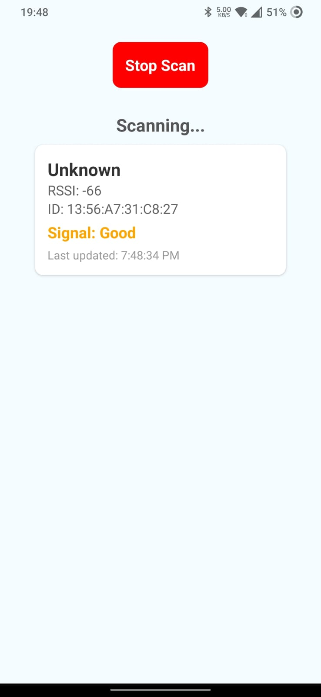

<h1 class="code-line" data-line-start=0 data-line-end=1 >BLE Scanner</h1>
<h2 class="code-line" data-line-start=1 data-line-end=2 >This React Native application, developed using Expo, scans for nearby Bluetooth Low Energy (BLE) devices and displays their names along with their Received Signal Strength Indication (RSSI) values.</h2>

<h2 class="code-line" data-line-start=3 data-line-end=4 >Prerequisites</h2>
<ul>
<li class="has-line-data" data-line-start="4" data-line-end="5">Node.js (v18 or later)</li>
<li class="has-line-data" data-line-start="6" data-line-end="7">Xcode (for iOS development)</li>
<li class="has-line-data" data-line-start="7" data-line-end="9">Android Studio (for Android development)</li>
</ul>
<h2 class="code-line" data-line-start=9 data-line-end=10 >Installation</h2>

Clone the project

<pre><code class="has-line-data" data-line-start="12" data-line-end="15" class="language-sh">git clone https://github.com/mohammadsahil01/ble-scanner
cd ble-scanner
</code></pre>

Install the dependencies and dev-dependencies

<pre><code class="has-line-data" data-line-start="19" data-line-end="21" class="language-sh">npm install
</code></pre>

OR

<pre><code class="has-line-data" data-line-start="23" data-line-end="25" class="language-sh">yarn install
</code></pre>
<h2 class="code-line" data-line-start=26 data-line-end=27 >Dependencies</h2>

- **react-native-ble-plx**
  - [react-native-ble-plx/readme.md](https://github.com/dotintent/react-native-ble-plx/blob/master/README.md)
- **react-native-permissions**
  - [react-native-permissions](https://github.com/react-native-community/react-native-permissions)
- **expo-device**
  - [expo-device/readme.md](https://docs.expo.dev/versions/latest/sdk/device/)
- **expo-dev-client**
  - [expo-dev-client/readme.md](https://docs.expo.dev/develop/development-builds/introduction/)
- **eas-cli**
  - [eas-cli/readme.md](https://github.com/expo/eas-cli)

<h2 class="code-line" data-line-start=38 data-line-end=39 >Running the app</h2>
<ol>
<li class="has-line-data" data-line-start="39" data-line-end="40">Install the Expo Go app on your iOS or Android device.</li>
<li class="has-line-data" data-line-start="40" data-line-end="41">Start the Expo development server: <code>npx expo start</code></li>
<li class="has-line-data" data-line-start="41" data-line-end="43">Scan the QR code with your device’s camera or the Expo Go app.</li>
</ol>

<h2 class="code-line" data-line-start=43 data-line-end=44 >Running the tests</h2>

To run the tests, simply run the command <code>npm test</code> OR <code>yarn test</code>

- ✔ Renders the App correctly (747 ms)
- ✔ Starts and Stops scanning (95 ms)
- ✔ Displays Devices (214 ms)

Test Suites: 1 passed, 1 total
Tests: 3 passed, 3 total
Snapshots: 0 total
Time: 3.392 s
Ran all test suites.

<h2 class="code-line" data-line-start=43 data-line-end=44 >Building Standalone Apps</h2>
<h3 class="code-line" data-line-start=45 data-line-end=46 >iOS (IPA)</h3>
<ol>
<li class="has-line-data" data-line-start="47" data-line-end="48">Run <code>expo build:ios</code></li>
<li class="has-line-data" data-line-start="48" data-line-end="50">Follow the prompts to generate an IPA file.</li>
</ol>
<h3 class="code-line" data-line-start=50 data-line-end=51 >Android (APK)</h3>
<ol>
<li class="has-line-data" data-line-start="52" data-line-end="53">Run <code>expo build:android -t apk</code></li>
<li class="has-line-data" data-line-start="53" data-line-end="55">Follow the prompts to generate an APK file.</li>
</ol>
<h2 class="code-line" data-line-start=55 data-line-end=56 >Notes and Caveats</h2>

- **Refresh Rate:** The app scans for nearby devices every 5 seconds to refresh the list.
- **Signal Strength Update:** It updates the signal strength of each device every 2 seconds.
- **Permissions:** Bluetooth permissions must be granted on the device for the app to function properly.
- **Android 12+ Note:** On Android 12+, location permissions may also be required for BLE scanning.

<h2 class="code-line" data-line-start=60 data-line-end=61 >Additional Features to Add</h2>
<ul>
<li class="has-line-data" data-line-start="62" data-line-end="63">Device Filtering: Add an option to filter devices by name or signal strength.</li>
<li class="has-line-data" data-line-start="63" data-line-end="64">Detailed Device Information: Display more detailed information about each device.</li>
</ul>

<h2 class="code-line" data-line-start=60 data-line-end=61 >Interesting Problems Encountered</h2>
<ul>
<li class="has-line-data" data-line-start="62" data-line-end="63">Real-time Updates: Ensuring real-time updates of RSSI values required setting up intervals and properly managing state updates without causing performance issues.</li>
</ul>
